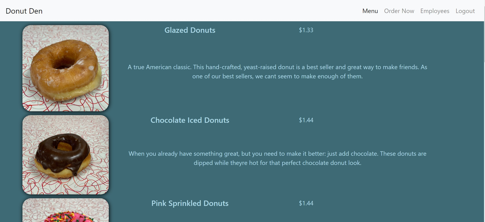
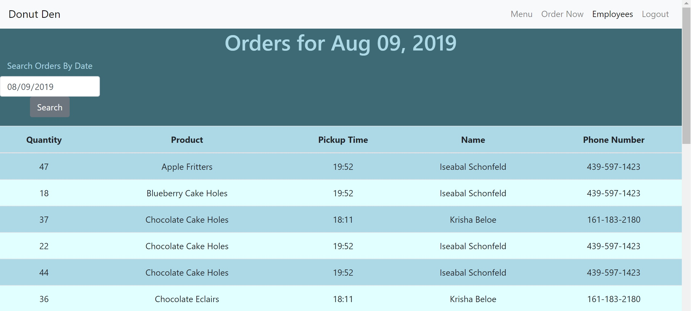
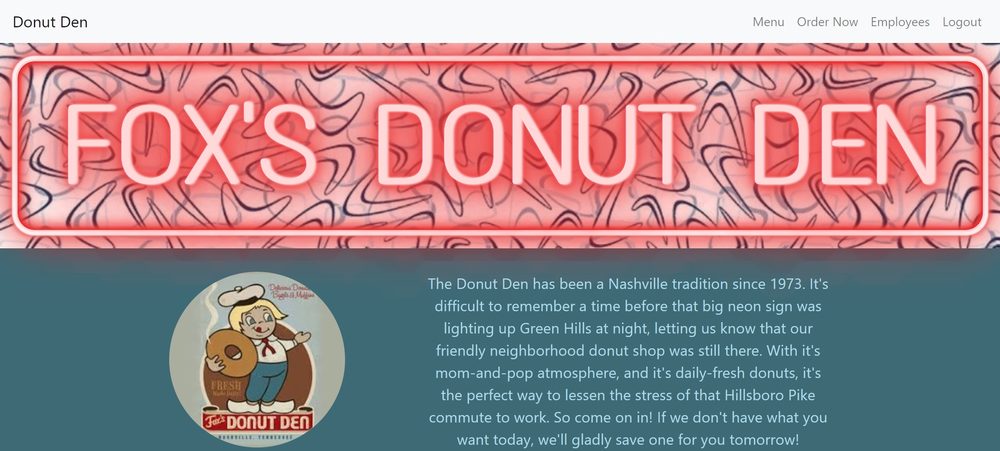

# Donut Den

  This is my back-end capstone at Nashville Software School.  I've been blessed to work at Nashville's original Donut Den for over ten years as a manager and a cook.  I love working there.  The owners are like family to me, I met my beautiful wife there, and I really care about what the future of the Donut Den looks like.  So I made this app as a gift and tribute to them.  Donut Den has been taking orders exclusivly by pencil and paper for the past 40 years.  I created an app to help manage those orders, and maybe someday, to be a tool that Donut Den customers can use to place orders online.  
  
  Orders can be written by anyone without authentication. However, orders cannot be submitted until the whole order form has been filled out.  This feature alone will help solve most of the order mishaps that I've seen in the past.  Once logged in, an employee will be able to see all orders for any day selected.  Orders are orginized in a manner that I believed most helpful for the cooks.  The primary goals of this app were to ensure that orders are filled out completely and that they wont get lost.  I plan to continue working on this app and add suggestions based on the requests of employees and other managers.  Hopfully this will be the legacy that I leave behind for the future of Donut Den, in return for all that this little donut shop has done for me.
  
 ### Technologies Used
 
 - React
 - Github
 - Bootstrap
 - Firebase
 - .Net
 - SQL Server
 
 ### Github Links
 
 <p><a href="">Donut Den Front End</a></p>
 
 <p><a href="">Donut Den Back End</a></p>
 
 ### Screenshots
 






### Run this project
- Query DonutDen_Seed.sql in SQL Manager
- Run the back end DonutDenData.sln
- Open the front end DonutDen
- Create an apiKeys.js file (see apiKeys.js.example)
- Type ```npm install``` in terminal to install necessary dependencies
- Type ```npm start``` to run project at http://localhost:3000

### Credits
This app was written by Timothy Harley(that's me!) with help from these kind people:
- Nathan Gonzales
- Martin Cross
- Adam Wieckert
- <a href="https://codepen.io/Zerchan">Edison Mora</a>

### Thank you all!
 
